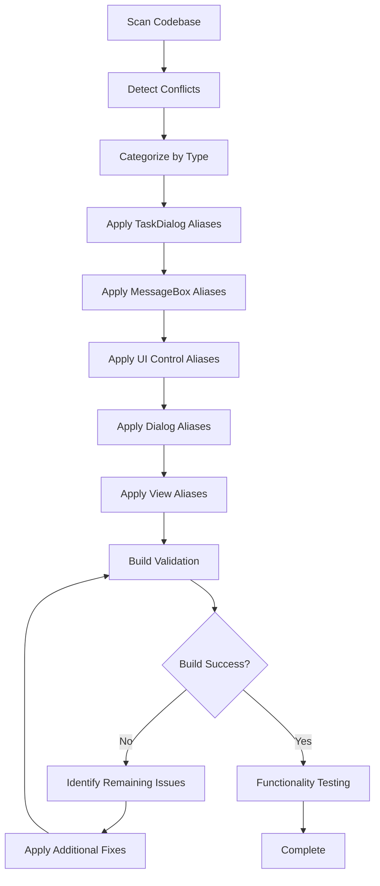

# Design Document

## Overview

The namespace conflict resolution system provides a systematic approach to eliminate the remaining 81 compilation errors in the RevitDtools .NET 8 migration. The design focuses on applying consistent namespace aliases across the codebase without breaking existing functionality. The solution uses automated detection, categorized resolution, and validation to ensure complete conflict elimination while maintaining code readability and .NET conventions.

## Architecture

### Conflict Resolution Strategy

The system employs a layered approach to namespace conflict resolution:

1. **Detection Layer**: Automated scanning to identify conflict locations and types
2. **Categorization Layer**: Grouping conflicts by type for systematic resolution
3. **Resolution Layer**: Applying consistent aliases using established patterns
4. **Validation Layer**: Build verification and functionality testing
5. **Documentation Layer**: Recording changes and establishing patterns for future use

### Processing Flow



## Components and Interfaces

### 1. Conflict Detection System

**Purpose**: Automatically identify namespace conflicts in the codebase.

**Implementation Strategy**:
```csharp
public class NamespaceConflictDetector
{
    public ConflictReport ScanProject(string projectPath)
    {
        var conflicts = new List<NamespaceConflict>();
        
        // Scan for TaskDialog conflicts
        conflicts.AddRange(DetectTaskDialogConflicts(projectPath));
        
        // Scan for MessageBox conflicts
        conflicts.AddRange(DetectMessageBoxConflicts(projectPath));
        
        // Scan for UI Control conflicts
        conflicts.AddRange(DetectUIControlConflicts(projectPath));
        
        // Scan for Dialog conflicts
        conflicts.AddRange(DetectDialogConflicts(projectPath));
        
        // Scan for View conflicts
        conflicts.AddRange(DetectViewConflicts(projectPath));
        
        return new ConflictReport { Conflicts = conflicts };
    }
}
```

**Detection Patterns**:
- **TaskDialog**: Look for `TaskDialog` usage without explicit namespace qualification
- **MessageBox**: Identify `MessageBox.Show` calls that could be ambiguous
- **UI Controls**: Find WPF control usage in files with multiple UI framework imports
- **File Dialogs**: Detect dialog instantiations without clear namespace context
- **View**: Locate Revit View usage that could conflict with other View classes

### 2. Alias Application System

**Purpose**: Apply consistent namespace aliases across the codebase.

**Alias Patterns**:
```csharp
public static class AliasPatterns
{
    // Revit API aliases
    public const string RevitTaskDialog = "using RevitTaskDialog = Autodesk.Revit.UI.TaskDialog;";
    public const string RevitView = "using RevitView = Autodesk.Revit.DB.View;";
    
    // WPF aliases
    public const string WpfMessageBox = "using WpfMessageBox = System.Windows.MessageBox;";
    public const string WpfTextBox = "using WpfTextBox = System.Windows.Controls.TextBox;";
    public const string WpfComboBox = "using WpfComboBox = System.Windows.Controls.ComboBox;";
    public const string WpfCheckBox = "using WpfCheckBox = System.Windows.Controls.CheckBox;";
    public const string WpfButton = "using WpfButton = System.Windows.Controls.Button;";
    
    // WinForms aliases
    public const string WinFormsOpenFileDialog = "using WinFormsOpenFileDialog = System.Windows.Forms.OpenFileDialog;";
    public const string WinFormsSaveFileDialog = "using WinFormsSaveFileDialog = System.Windows.Forms.SaveFileDialog;";
    public const string WinFormsFolderBrowserDialog = "using WinFormsFolderBrowserDialog = System.Windows.Forms.FolderBrowserDialog;";
    public const string WinFormsMessageBox = "using WinFormsMessageBox = System.Windows.Forms.MessageBox;";
}
```

**Application Strategy**:
```csharp
public class AliasApplicator
{
    public void ApplyAliases(string filePath, List<NamespaceConflict> conflicts)
    {
        var fileContent = File.ReadAllText(filePath);
        var modifiedContent = fileContent;
        var aliasesToAdd = new HashSet<string>();
        
        foreach (var conflict in conflicts)
        {
            switch (conflict.Type)
            {
                case ConflictType.TaskDialog:
                    aliasesToAdd.Add(AliasPatterns.RevitTaskDialog);
                    modifiedContent = ReplaceTaskDialogReferences(modifiedContent);
                    break;
                    
                case ConflictType.MessageBox:
                    aliasesToAdd.Add(AliasPatterns.WpfMessageBox);
                    modifiedContent = ReplaceMessageBoxReferences(modifiedContent);
                    break;
                    
                // Additional cases for other conflict types...
            }
        }
        
        // Add aliases to the top of the file
        modifiedContent = AddAliasesToFile(modifiedContent, aliasesToAdd);
        
        File.WriteAllText(filePath, modifiedContent);
    }
}
```

### 3. TaskDialog Conflict Resolution

**Conflict Pattern**: Ambiguity between `Autodesk.Revit.UI.TaskDialog` and WPF TaskDialog.

**Resolution Strategy**:
1. **Detection**: Scan for `TaskDialog` usage in files with both Revit and WPF imports
2. **Alias Application**: Add `using RevitTaskDialog = Autodesk.Revit.UI.TaskDialog;`
3. **Reference Updates**: Replace `TaskDialog` with `RevitTaskDialog` in instantiations and type references
4. **Validation**: Ensure all TaskDialog functionality remains intact

**Implementation Details**:
```csharp
private string ReplaceTaskDialogReferences(string content)
{
    // Replace TaskDialog instantiations
    content = Regex.Replace(content, @"\bnew TaskDialog\b", "new RevitTaskDialog");
    
    // Replace TaskDialog type references
    content = Regex.Replace(content, @"\bTaskDialog\s+(\w+)", "RevitTaskDialog $1");
    
    // Replace TaskDialog static method calls
    content = Regex.Replace(content, @"\bTaskDialog\.", "RevitTaskDialog.");
    
    return content;
}
```

### 4. MessageBox Conflict Resolution

**Conflict Pattern**: Ambiguity between `System.Windows.MessageBox` and `System.Windows.Forms.MessageBox`.

**Resolution Strategy**:
1. **Context Analysis**: Determine if WPF or WinForms MessageBox is intended
2. **Primary Alias**: Use `WpfMessageBox` for System.Windows.MessageBox (most common)
3. **Secondary Alias**: Add `WinFormsMessageBox` if WinForms version is also used
4. **Method Updates**: Replace `MessageBox.Show` with appropriate aliased version

**Implementation Details**:
```csharp
private string ReplaceMessageBoxReferences(string content)
{
    // Replace MessageBox.Show calls
    content = Regex.Replace(content, @"\bMessageBox\.Show\b", "WpfMessageBox.Show");
    
    // Replace MessageBox type references
    content = Regex.Replace(content, @"\bMessageBox\s+(\w+)", "WpfMessageBox $1");
    
    return content;
}
```

### 5. UI Control Conflict Resolution

**Conflict Pattern**: Ambiguity between WPF and WinForms controls with same names.

**Resolution Strategy**:
1. **Control Identification**: Detect which controls are causing conflicts
2. **Context-Aware Aliasing**: Apply WPF aliases for WPF windows, WinForms aliases for WinForms
3. **XAML Consistency**: Ensure XAML and code-behind use consistent references
4. **Comprehensive Coverage**: Handle TextBox, ComboBox, CheckBox, Button, and other common controls

**Implementation Details**:
```csharp
private Dictionary<string, string> GetControlAliases()
{
    return new Dictionary<string, string>
    {
        { "TextBox", "WpfTextBox" },
        { "ComboBox", "WpfComboBox" },
        { "CheckBox", "WpfCheckBox" },
        { "Button", "WpfButton" },
        { "ListBox", "WpfListBox" },
        { "Label", "WpfLabel" }
    };
}

private string ReplaceControlReferences(string content, string controlName, string alias)
{
    // Replace control instantiations
    content = Regex.Replace(content, $@"\bnew {controlName}\b", $"new {alias}");
    
    // Replace control type references
    content = Regex.Replace(content, $@"\b{controlName}\s+(\w+)", $"{alias} $1");
    
    // Replace control casts
    content = Regex.Replace(content, $@"\({controlName}\)", $"({alias})");
    
    return content;
}
```

### 6. File Dialog Conflict Resolution

**Conflict Pattern**: Ambiguity between WPF dialogs (Microsoft.Win32) and WinForms dialogs.

**Resolution Strategy**:
1. **Dialog Type Detection**: Identify OpenFileDialog, SaveFileDialog, and FolderBrowserDialog usage
2. **Framework Preference**: Use WinForms dialogs for consistency with existing code
3. **Property Mapping**: Ensure all dialog properties and methods are correctly referenced
4. **Result Handling**: Maintain existing dialog result handling patterns

**Implementation Details**:
```csharp
private string ReplaceDialogReferences(string content)
{
    // Replace OpenFileDialog
    content = Regex.Replace(content, @"\bnew OpenFileDialog\b", "new WinFormsOpenFileDialog");
    content = Regex.Replace(content, @"\bOpenFileDialog\s+(\w+)", "WinFormsOpenFileDialog $1");
    
    // Replace SaveFileDialog
    content = Regex.Replace(content, @"\bnew SaveFileDialog\b", "new WinFormsSaveFileDialog");
    content = Regex.Replace(content, @"\bSaveFileDialog\s+(\w+)", "WinFormsSaveFileDialog $1");
    
    // Replace FolderBrowserDialog
    content = Regex.Replace(content, @"\bnew FolderBrowserDialog\b", "new WinFormsFolderBrowserDialog");
    content = Regex.Replace(content, @"\bFolderBrowserDialog\s+(\w+)", "WinFormsFolderBrowserDialog $1");
    
    return content;
}
```

### 7. View Conflict Resolution

**Conflict Pattern**: Ambiguity between `Autodesk.Revit.DB.View` and other View classes.

**Resolution Strategy**:
1. **Revit Context Detection**: Identify files working with Revit views
2. **Alias Application**: Apply `RevitView` alias for Autodesk.Revit.DB.View
3. **Method Preservation**: Ensure all Revit view operations continue to work
4. **Type Safety**: Maintain strong typing for view-related operations

**Implementation Details**:
```csharp
private string ReplaceViewReferences(string content)
{
    // Replace View type references in Revit context
    content = Regex.Replace(content, @"\bView\s+(\w+)\s*=", "RevitView $1 =");
    
    // Replace View in method parameters
    content = Regex.Replace(content, @"\(View\s+(\w+)\)", "(RevitView $1)");
    
    // Replace View in generic constraints
    content = Regex.Replace(content, @"<View>", "<RevitView>");
    
    return content;
}
```

## Data Models

### Conflict Detection Models

```csharp
public class NamespaceConflict
{
    public string FilePath { get; set; }
    public int LineNumber { get; set; }
    public ConflictType Type { get; set; }
    public string ConflictingSymbol { get; set; }
    public string Context { get; set; }
    public List<string> PossibleNamespaces { get; set; }
}

public enum ConflictType
{
    TaskDialog,
    MessageBox,
    TextBox,
    ComboBox,
    CheckBox,
    Button,
    OpenFileDialog,
    SaveFileDialog,
    FolderBrowserDialog,
    View,
    Other
}

public class ConflictReport
{
    public List<NamespaceConflict> Conflicts { get; set; }
    public Dictionary<ConflictType, int> ConflictCounts { get; set; }
    public List<string> AffectedFiles { get; set; }
    public DateTime ScanTimestamp { get; set; }
}
```

### Resolution Tracking Models

```csharp
public class ResolutionResult
{
    public string FilePath { get; set; }
    public List<string> AliasesAdded { get; set; }
    public List<string> ReferencesUpdated { get; set; }
    public bool Success { get; set; }
    public string ErrorMessage { get; set; }
}

public class BuildValidationResult
{
    public bool BuildSuccessful { get; set; }
    public int ErrorCount { get; set; }
    public int WarningCount { get; set; }
    public List<string> RemainingErrors { get; set; }
    public TimeSpan BuildTime { get; set; }
}
```

## Error Handling

### Conflict Resolution Error Handling

1. **File Access Errors**:
   - Handle read-only files gracefully
   - Provide clear error messages for permission issues
   - Implement retry logic for temporary file locks

2. **Regex Pattern Errors**:
   - Validate regex patterns before application
   - Handle edge cases in code pattern matching
   - Provide fallback manual resolution options

3. **Build Validation Errors**:
   - Parse build output to identify remaining conflicts
   - Categorize new errors introduced by changes
   - Provide rollback capability if needed

```csharp
public class ConflictResolutionErrorHandler
{
    public static ResolutionResult HandleFileError(string filePath, Exception ex)
    {
        return new ResolutionResult
        {
            FilePath = filePath,
            Success = false,
            ErrorMessage = $"Failed to process {filePath}: {ex.Message}"
        };
    }
    
    public static void RollbackChanges(List<string> modifiedFiles, Dictionary<string, string> backups)
    {
        foreach (var file in modifiedFiles)
        {
            if (backups.ContainsKey(file))
            {
                File.WriteAllText(file, backups[file]);
            }
        }
    }
}
```

## Testing Strategy

### 1. Conflict Detection Testing

```csharp
[TestClass]
public class ConflictDetectionTests
{
    [TestMethod]
    public void DetectTaskDialogConflicts_WithAmbiguousUsage_ReturnsConflicts()
    {
        // Test conflict detection accuracy
        var detector = new NamespaceConflictDetector();
        var testCode = "TaskDialog dialog = new TaskDialog();";
        var conflicts = detector.DetectConflictsInCode(testCode);
        
        Assert.IsTrue(conflicts.Any(c => c.Type == ConflictType.TaskDialog));
    }
}
```

### 2. Alias Application Testing

```csharp
[TestClass]
public class AliasApplicationTests
{
    [TestMethod]
    public void ApplyTaskDialogAlias_UpdatesReferences_Correctly()
    {
        var applicator = new AliasApplicator();
        var originalCode = "TaskDialog dialog = new TaskDialog();";
        var expectedCode = "RevitTaskDialog dialog = new RevitTaskDialog();";
        
        var result = applicator.ApplyTaskDialogAlias(originalCode);
        
        Assert.AreEqual(expectedCode, result);
    }
}
```

### 3. Build Validation Testing

```csharp
[TestClass]
public class BuildValidationTests
{
    [TestMethod]
    public void ValidateBuild_AfterConflictResolution_ReturnsSuccess()
    {
        var validator = new BuildValidator();
        var result = validator.ValidateProject("RevitDtools.csproj");
        
        Assert.IsTrue(result.BuildSuccessful);
        Assert.AreEqual(0, result.ErrorCount);
    }
}
```

## Performance Considerations

### 1. Efficient File Processing

- **Batch Processing**: Process multiple files in parallel where safe
- **Memory Management**: Use streaming for large files
- **Backup Strategy**: Create minimal backups only when necessary
- **Incremental Processing**: Skip files that don't need changes

### 2. Build Optimization

- **Incremental Builds**: Use MSBuild incremental compilation
- **Parallel Compilation**: Enable multi-processor builds
- **Cache Management**: Leverage build caches effectively

### 3. Regex Performance

- **Compiled Patterns**: Use compiled regex for repeated operations
- **Pattern Optimization**: Design efficient regex patterns
- **Context Awareness**: Apply patterns only where relevant

## Validation and Quality Assurance

### 1. Pre-Resolution Validation

- **Backup Creation**: Create complete project backup before starting
- **Dependency Analysis**: Verify all project dependencies are available
- **Build Baseline**: Establish current error count and types

### 2. Post-Resolution Validation

- **Build Verification**: Ensure zero compilation errors
- **Functionality Testing**: Verify existing features work correctly
- **Performance Testing**: Ensure no performance degradation
- **Code Quality**: Maintain readability and maintainability

### 3. Rollback Strategy

- **Change Tracking**: Record all modifications made
- **Selective Rollback**: Ability to rollback specific changes
- **Validation Points**: Multiple checkpoints during resolution process

This design provides a comprehensive, systematic approach to resolving all 81 namespace conflicts while maintaining code quality, functionality, and following .NET best practices. The modular design allows for incremental resolution and validation at each step.